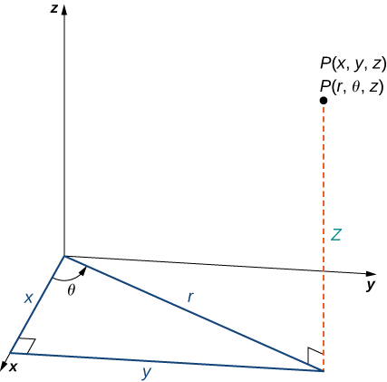

You can also directly instantiate the Value classes if you wish, and sometimes it is desirable to do so.

!!! see-also "Mutable vs. Immutable"
    This section details the concrete implementations that are available for the various values in Fermat. Many of these implementations have a `Mutable` and an `Immutable` version.
    
    For more detailed information about the differences between these, and the situations that each might be useful in, please see the page on [mutability](mutability.md).

# Values of Decimal

These classes extend the `Decimal` abstract class, which comes with the following interfaces, traits, and constructor.

### Interfaces

--8<-- "has-interface/hashable.md"

--8<-- "has-interface/base-conversion.md"

--8<-- "has-interface/number.md"

--8<-- "has-interface/simple-number.md"

--8<-- "has-interface/decimal.md"

### Traits

--8<-- "uses-trait/arithmeticsimple.md"

--8<-- "uses-trait/comparison.md"

--8<-- "uses-trait/integer-math.md"

--8<-- "uses-trait/trigonometry.md"

--8<-- "uses-trait/inverse-trigonometry.md"

--8<-- "uses-trait/log.md"

--8<-- "uses-trait/scale.md"

### Constructor

!!! signature "__construct(mixed $value, int $scale = 10, int $base = 10)"
    $value
    :   The value to create the instance with
    
    $scale
    :   The maximum number of digits after the decimal that the instance can have
    
    $base
    :   The base of the instance created
    
    return
    :   An instance of **Decimal** created with the provided arguments as parameters

The constructor will take an `integer`, a `float`, or any `numeric string` (including imaginary values) as its input value. The scale and base must be given as integers, and can be omitted where they will take their default values of 10. This means that by default instances of `Decimal` will be in base-10 and calculate 10 digits of scale for all operations.

!!! potential-bugs "You Might Not Expect"
    If an instance of `Decimal` is provided, it will be treated as a string and will construct correctly. However, it will not inherit the `$scale` or `$base` settings for the instance provided as a `$value`. 
    
!!! warning "Warning"
    If the instance provided is in a base other than 10, the `$base` provided to the constructor should match that value, or you will eventually get exceptions and potentially PHP fatals.
    
!!! danger "Danger"
    Providing an instance of `Fraction` or `ComplexNumber` will appear to build the new instance correctly, but will result in a PHP fatal error on calls to any methods on the new instance.

## ImmutableNumber

A number which can be represented as a decimal and has a maximum scale of $`2^{63}`$ digits. This value is immutable, and all methods called on instances of the class will return a new instance of the same class while leaving the existing instance at its original value.

## MutableNumber

A number which can be represented as a decimal and has a maximum scale of $`2^{63}`$ digits. This value is mutable, and all methods called on instances of the class will return the same instance after modification, while the previous value will be lost.

# Values of Fraction

Used to represent numbers in a fraction format. The `/` character is used in string representations to denote the fraction bar, and is used to create instances from strings. In these cases, it is assumed that the numerator is to the left of the fraction bar, and the denominator is the right.

The numerator and denominator must also be whole numbers. If a mathematical operation results in non-whole values for either the numerator or denominator, the `Fraction` is converted to a `Decimal` using the `asDecimal()` method on the `FractionInterface`.

These classes extend the `Fraction` abstract class, which comes with the following interfaces, traits, and constructor.

### Interfaces

--8<-- "has-interface/hashable.md"

--8<-- "has-interface/base-conversion.md"

--8<-- "has-interface/number.md"

--8<-- "has-interface/simple-number.md"

--8<-- "has-interface/fraction.md"

### Traits

--8<-- "uses-trait/arithmeticsimple.md"

--8<-- "uses-trait/comparison.md"

### Constructor

!!! signature "__construct(mixed $numerator, mixed $denominator, $base = 10)"
    $numerator
    :   The value of the numerator, using the same restrictions as **Decimal**
    
    $denominator
    :   The value of the denominator, using the same restrictions as **Decimal**
    
    $base
    :   The base of the instance created
    
    return
    :   An instance of **Fraction** created with the provided arguments as parameters

The constructor will take an `integer`, a `float`, any `numeric string`, or an instance of `DecimalInterface` as its input value. The base must be given as an integer, and if omitted it will take the default value of 10. This means that by default instances of `Fraction` will be in base-10.

!!! potential-bugs "Rounding"
    In the constructor, non-integer values for the numerator or denominator are automatically rounded to the nearest integer using the "half up" method.

!!! potential-bugs "Type Coercion"
    If an instance implementing `DecimalInterface` is provided, it will be coerced into an `ImmutableDecimal`. This will leave the original instance unaffected by operations performed on the `Fraction`, even if an instance of `MutableDecimal` was originally provided.

## ImmutableFraction

A number which can be represented as a fraction. This value is immutable, and all methods called on instances of the class will return a new instance of the same class while leaving the existing instance at its original value.

## MutableFraction

A number which can be represented as a fraction. This value is mutable, and all methods called on instances of the class will return the same instance after modification, while the previous value will be lost.

# Values of ComplexNumber

Used to represent complex number values. Either part can be an instance of `FractionInterface` or `DecimalInterface`, however while `Decimal` values can be provided as an `object`, a `string`, an `integer`, or a `float`, you must explicitly provide an instance of `Fraction` if you wish for one of the components to be in that format.

!!! caution "Unexpected Class Inheritance Structure"
    While the name of this class is `ComplexNumber`, it does not extend the abstract `Number` class like `Fraction` and `Decimal` do. Instead, it extends `PolarCoordinate`, since this is an advantageous representation of complex numbers in many situations.
    
    The arguments to the `ComplexNumber` class correspond directly with a set of `CartesianCoordinate`s. These are then transformed into an instance of `PolarCoordinate` which is a more useful form for doing operations like `pow()` and `sqrt()`.

### Interfaces

--8<-- "has-interface/complex-number.md"

--8<-- "has-interface/coordinate.md"

### Traits

--8<-- "uses-trait/arithmeticcomplex.md"

### Constructor

!!! signature "__construct(mixed $realPart, mixed $imaginaryPart, ?int $scale = null, int $base = 10)"
    $realPart
    :   The value of the real part; can be an instance of **FractionInterface**, and instance of **DecimalInterface**, or a scalar using the same restrictions as **Decimal**
    
    $imaginaryPart
    :   The value of the imaginary part; can be an instance of **FractionInterface**, and instance of **DecimalInterface**, or a scalar using the same restrictions as **Decimal**
    
    $scale
    :   The maximum number of digits after the decimal that the instance components can have
    
    $base
    :   The base of the instance created
    
    return
    :   An instance of **ComplexNumber** created with the provided arguments as parameters

## ImmutableComplexNumber

A number which can be represented as a complex number. This value is immutable, and all methods called on instances of the class will return a new instance of the same class while leaving the existing instance at its original value.

## MutableComplexNumber

A number which can be represented as a complex number. This value is mutable, and all methods called on instances of the class will return the same instance after modification, while the previous value will be lost.

# Values of Matrix

Used to represent mathematical matrices and perform matrix math.

### Interfaces

### Traits

### Constructor

!!! signature "__construct(array $data, string $mode = Matrix::MODE_ROWS_INPUT)"
    $data
    :   An array of **NumberCollection**s, defining either the rows or the columns of the matrix; see below for more detailed information
    
    $mode
    :   Accepts either the string 'rows' or 'columns', defining whether the number in **$data** are organized as an array of rows or an array of columns
    
    return
    :   An instance of **Matrix** created with the provided arguments as parameters
    
The input array has several restrictions and assumptions. The most obvious, given that it is meant to represent matrix data, is that each `NumberCollection` in the provided array must contain the same number of elements.

Further, while the data can represent *either* the array of rows or array of columns depending on the `$mode` provided, it will always fill the matrix starting from the upper left corner. This is also the same indexing used by `getRow()`, `getColumn()`, or any other function that references a row or column index.

## ImmutableMatrix

## MutableMatrix

# Values of Coordinate

The specific interfaces, traits, and constructor for the different values of `Coordinate` depend on the value class used. This information is detailed in the [Types & Values > Coordinates](../types-and-values/coordinates.md) documenation.

!!! potential-bugs "Coordinates Are Mutable"
    Unlike many other values, all implementations of `Coordinate` are designed as mutable classes. This design decision was made mainly because of how coordinates are usually used in math. 
    
    Typically, when an operation of some kind is performed on a coordinate, the resulting coordinate is treated as the only existant value, and previous coordinate is removed from the data set. Mutable implementations mirror this behavior.
    
    However, the underlying `Decimal` values that represent that coordinate components are instances of `ImmutableDecimal`. This means that while the coordinate instances will be mutable, and decimal instances used as input for the coordinates will remain unaffected.

## CartesianCoordinate

A set of coordinates where each value represents the position along a single plane. These are the coordinates that are most commonly used in algebra and geometry, typically presented in format (x, y) for two-dimensional coordinates, and (x, y, z) for three-dimensional coordinates.

## CylindricalCoordinate

A set of three-dimensional coordinates represented by (r, $`\theta`$, z), where (r, $`\theta`$) are the polar coordinates of the *xy*-plane, and (z) is the normal *z*-coordinate in a Cartesian coordinate representation.

*This image is licensed under [CC-BY-NC-SA-4.0](https://creativecommons.org/licenses/by-nc-sa/4.0/) and was created by Gilbert Strang & Edwin “Jed” Herman*

## PolarCoordinate

A set of two-dimensional coordinates represented by (r, $`\theta`$), where (r) is the distance to the origin, and ($`\theta`$) is the angle in radians from the positive *x*-axis.

## SphericalCoordinate

A set of three-dimensional coordinates represented by ($`\rho`$, $`\theta`$, $`\varphi`$), where ($`\rho`$) is the distance to the origin, ($`\theta`$) is the angle in radians from the positive *x*-axis in the *xy*-plane, and ($`\varphi`$) is the angle in radians from the positive *z*-axis to the line formed by ($`\rho`$).

*This image is licensed under [CC-BY-NC-SA-4.0](https://creativecommons.org/licenses/by-nc-sa/4.0/) and was created by Gilbert Strang & Edwin “Jed” Herman*